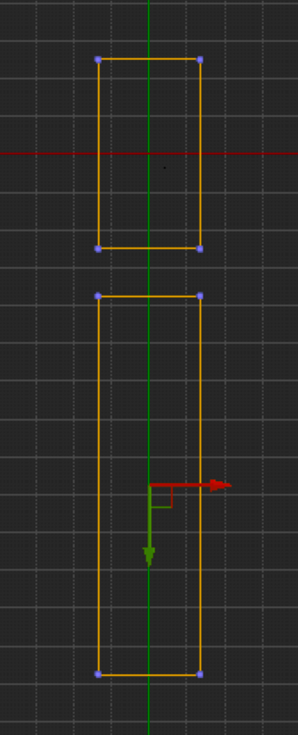

# BasicGame

## Level Editor

Hold down the mouse and press

W,A,S,D: forward, left, backward, right

Q,E: upward, downward

Z,C: zoom in, zoom out (temporary)


F:

Click on an object and hold down F key, the clicked object will be focused

Hold down **option** key and one finger the view will rotate around the focused object
Hold down **option** key and two fingers the view will zoom in/out around the focused object


W, E, R
W: Move
Hold down shift key and select multiple actors, then all selected actors will move at the same time

Hold down shift key and move the actor, then the camera will move along the actor (1D or 2D only)
E: Rotate
R: Scale


Control + W : copy an actor

Hold down option key and move the actor, a copy of actor be generated long the path.


world space and local space


## Actors
### Create New Level
Create a new empty level

### Save A New Level
* Save
  * File -> Save all
  * Under ```Content```, create a new folder and name it MyContent
  * Name the new level DemoLevel
* Change Project Setting
  * Edit -> Project Setting
  * Click ```Maps & Modes``` under ```Project```
  * Change both ```Editor Default Map``` and ```Game Default Map``` to DemoLevel


### Create the Sky

* Visual Effects -> Atmospheric Fog
* Lights -> Directional lights (rename it to Sunlight)
  * Change ```Mobility``` to ```Static```
  * Check ```Atmosphere Sun Light```
  * Set ```Rotation``` to ```0, -70, 0```
* All Classes -> BP_Sky_Sphere
  * Set ```Directional Light Actor``` to Sunlight Actor
  * Set ```Cloud Speed``` to 4.0


### Create the Playing Area (Bounding Area)

* Create Ground1
  * Content Browser -> Materials -> M_Ground_Grass
  * Geometry -> Box
  * Set Transform -> Location to 0, 0, 0
  * Set Brush Settings -> X, Y, Z to 2700, 5000, 10


* Create Ground2
  * Content Browser -> Materials -> M_Ground_Grass
  * Geometry -> Box
  * Set Transform -> Location to 0, 8750, 0
  * Set Brush Settings -> X, Y, Z to 2700, 10000, 10

Change ```Perspetive``` to ```Top``` and two grounds are aligned like this:



* Create Player Start
  * Basic -> Player Start
  * Set Transform -> Location to 0, -2300, 100
  * Set Transform -> Rotation to 0, 0, 90


* Create LeftWall
  * Content Browser -> Materials -> M_Brick_Cut_Stone
  * Geometry -> Box
  * Set Transform -> Location to 1312.5, 5625, 205
  * Set Brush Settings -> X, Y, Z to 75, 16250, 400


* Create RightWall
  * Copy LeftWall
  * Set Transform -> Location to -1312.5, 5625, 205


* Create BottomWall
  * Content Browser -> Materials -> M_Brick_Cut_Stone
  * Set Transform -> Location to 0, -2462.5, 205
  * Set Brush Settings -> X, Y, Z to 2550, 75, 400


* Create TopWall
  * Copy BottomWall
  * Set Transform -> Location to 0, 13712.5, 205


### Build the Inner Structures of the Level

* Create LowWallBottomLeft
  * Content Browser -> Materials -> M_Cobble_Stone_Rough
  * Geometry -> Basic -> Box
  * Size: 800, 200, 200
  * Location: 875, 5875, 105


* Create LowWallBottomRight
  * Copy LowWallBottomLeft
  * Location: -875, 5875, 105


* Create LowWallTopRight
  * Copy LowWallBottomRight
  * Location: -700, 8530, 110
  * Size: 1150, 200, 200


* Create LowWallTopLeft
  * Copy LowWallTopRight
  * Location: 700, 8530, 110
  * Size: 1150, 200, 200


* Create PlatformBlock1
  * Materials -> M_Cobble_Stone_Rough
  * Box
  * Size: 110, 110, 110
  * Location: 0, -800, 60


* Create PlatformBlock2
  * Copy PlatformBlock1 (Green)
  * Location: 0, -690, 60


* Create PlatformBlock3
  * Copy PlatformBlock2 (Blue)
  * Location: 0, -690, 170


* Group PlatformBlock1, PlatformBlock2, PlatformBlock3
  * Select three blocks
  * Control G to

* Copy Group of 3 Blocks
  * Copy (Green)
  * Rotate -180 degrees (Don't set Rotation value because this will rotate all single blocks)


* Arrange the 2 Groups
  * Top Perspective
  * Zoom until the scale is 1 m
  * Make sure the distance between the 2 groups is 5 meters


* Create Wall of Fire
  * Particles -> P_Fire
  * Transform -> Scale: 4.0
  * Put the fire between the two platforms
  * Copy (Red) to form a wall


* Create House
  * HouseFenceWall1_1
    * Materials -> M_Brick_Cut_Stone
    * Box
    * Location: -825, 9100, 205
    * Size: 900, 50, 400
  * HouseFenceWall2_1
    * Location: -400, 9775, 205
    * Size: 50, 1300, 400  
  * HouseFenceWall3_1
    * Location: -700, 10400, 205
    * Size: 550, 50, 400  
  * House1
    * Materials -> M_Basic_Wall
    * Box
    * Location: -850, 9750, 250
    * Size: 500, 500, 500    
    * Wall Thickness: 10
    * Brush Setting -> Set Hollow to True
  * Doorway1 for House1
    * Box -> Set to Subtract
    * Location: -850, 500, 1550
    * Size: 200, 10, 300
  * Interior Design  
    * Apply M_Wood_Floor_Walnut_Polished to the floor
    * Props -> SM_Chair -> Chair1
    * Props -> SM_Table -> Table1
    * Props -> SM_Lamp_Ceiling
    * Lights -> Point Light -> LampLight1
      * Place under lamp
      * Set mobility to static
      * Set attenuation to 500 (so the sphere is slightly larger than the house)

* Copy House
  * Group the first house together
  * Switch to top Perspective
  * Make 3 copies of the house so there are 4 in total
